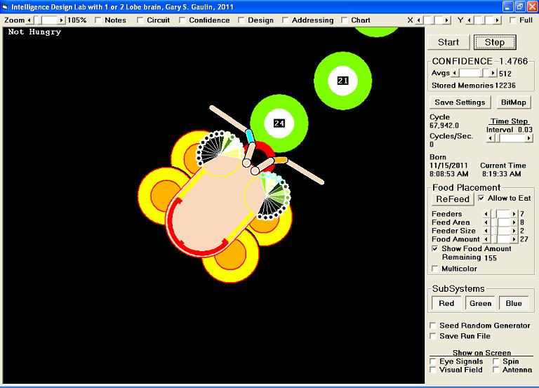

## Intelligence Design Lab

### Description

This next generation Intelligence Generator (also on Planet Source Code) computer model is (as per Occam’s Razor) made to be as simple as possible to reduce all that is happening in a complex biological circuit of an intelligent living thing to what is most important to understand about the way self-learning intelligence works, in this case a compound eye insect. The program provides a precise and testable operational definition for “intelligence” where taking all sensors out of memory addressing demonstrates "protointelligence", while clicking out its Red Green Blue vision subsystems from both confidence and memory renders it completely “unintelligent” in which case it only expresses Brownian motion type random behavior. The computer model also provides a precise, testable and scientifically useful operational definition for "intelligent cause" where each of the three emergent levels can be individually modeled, with a model predicted to be possible that generates an intelligent causation event, now goal of further research and challenge for all. Applying this model to biology shows advantages of a two lobed brain over a single lobe that would have to be much larger to control the same amount of sensory input. This model also provides insight into the origin of life, intelligence, and mechanisms that produces new species including human which was found to be systematically the primary result of good-guess chromosome speciation from fusion of two ancestral chromosomes which created our second largest. The code is useful for game engines and other applications that require virtual intelligence, is relatively well commented, has on-screen tool-tip-text, and 30 pages of referenced documentation.
 
### More Info
 

             |
---                |---
**Submitted On**   |2011-11-22 03:12:38
**By**             |[Gary Gaulin](https://github.com/Planet-Source-Code/PSCIndex/blob/master/ByAuthor/gary-gaulin.md)
**Level**          |Intermediate
**User Rating**    |2.6 (13 globes from 5 users)
**Compatibility**  |VB 6\.0
**Category**       |[Games](https://github.com/Planet-Source-Code/PSCIndex/blob/master/ByCategory/games__1-38.md)
**World**          |[Visual Basic](https://github.com/Planet-Source-Code/PSCIndex/blob/master/ByWorld/visual-basic.md)
**Archive File**   |[Intelligen22151711222011\.zip](https://github.com/Planet-Source-Code/gary-gaulin-intelligence-design-lab__1-74175/archive/master.zip)

